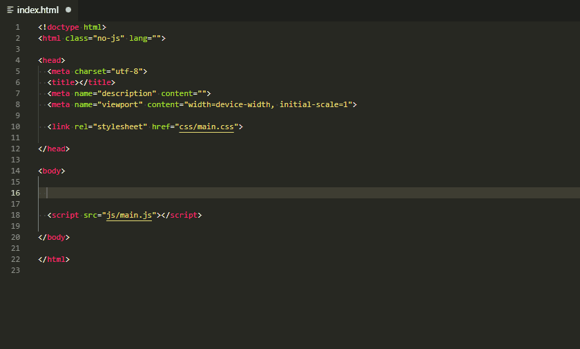
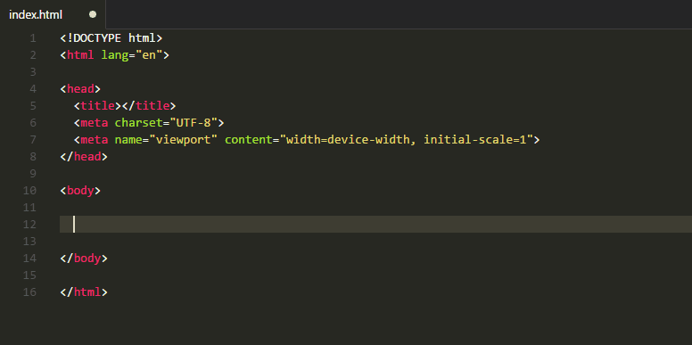

# cdnjs.com extension for Visual Studio Code

Search for and embed libraries from [cdnjs.com](https://cdnjs.com) into your HTML using Visual Studio Code commands.

This extension uses the cdnjs.com API to search for libraries that are hosted on cdnjs.com. You choose whatever version of the library you wish and then insert library urls directly into your HTML, copy them to your clipboard or open them in your browser.

---
## Features
- Search for any published version of any library hosted on cdnjs.com
- Embed those library's file urls directly into your documents
- Insert urls, `<script>` and  `<link>` tags into your HTML for JS and CSS files
- Copy urls, `<script>` and `<link>` tags to your system clipboard
- Open any file url in your browser
- Choose from a list of your most recently used libraries

---
## Recent Libraries
- Keeps track of your most recently used libraries for you to quickly choose from

---
## Built-in, automatic, persistent caching
- Caches your cdnjs.com search results and library data
- Cache is persistent between Visual Studio Code sessions
- User configurable expiration time (default: 6 hours)
- Cache can be cleared at any time using a command

---
## Visual Studio Code Commands

### `cdnjs: Search for libraries`

- Perform a search for libraries on cdnjs.com

### `cdnjs: Recent libraries`

- View a list of your most recently used libraries for you to quickly access

### `cdnjs: Clear cache`

- Empty/clear/flush the cache

## Settings
---

### `cdnjs.quoteStyle`

- Quote style for HTML tags. Possible values are `single` or `double`
- Default: `single`

### `cdnjs.protcol`

- Protocol for urls in HTML tags. Possible values are `https://`, `http://` or `//`
- Default: `https://`

### `cdnjs.maxRecentLibraries`

- The maxmium number of Recent Libraries to save
- Default: `10`

### `cdnjs.cacheTime`

- The length of time (in seconds) to cache library and search results
- Default: `21600` (6 hours)